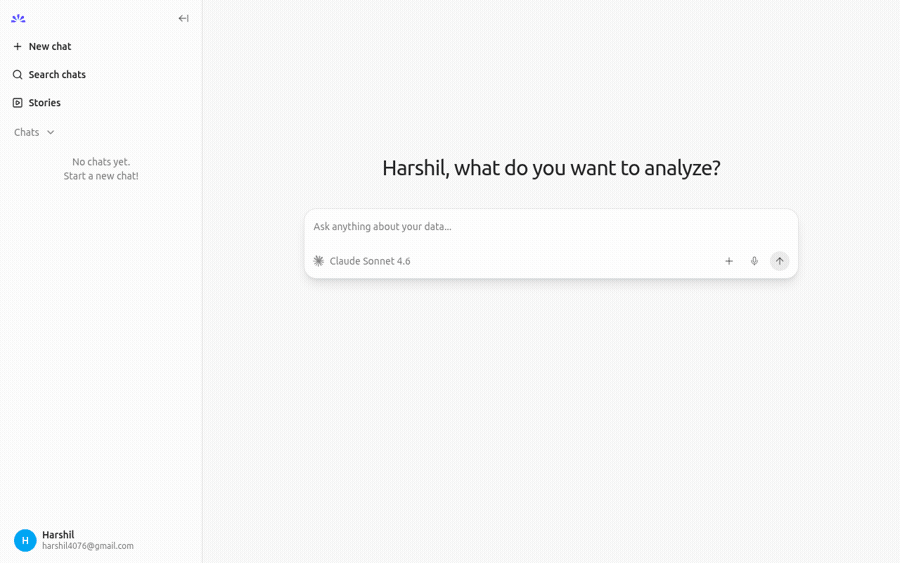

# Energy Submetering — Semantic Layer + AI Chat Agent

A **semantic layer** built on real energy data, with an AI chat agent on top so anyone can query structured meter data, maintenance records, and operational context in plain English and get visualizations.



## What is a Semantic Layer?

Raw data has cryptic column names (`Sub_metering_1`, `Global_active_power`) and formulas buried in documentation. A semantic layer sits on top and translates them into business-friendly terms:

> "Kitchen Consumption" = `SUM(Sub_metering_1)`
> "Estimated Cost" = `total_kwh × €0.18`
> "Peak Hours" = 06:00–21:59

Change a definition in one place and every query, dashboard, and report updates automatically.

---

## Datasets

### Dataset 1 — UCI Household Electric Power Consumption

- ~2 million minute-level readings from a household near Paris
- December 2006 – November 2010 (47 months)
- 3 submetering channels + overall power, voltage, and current

**Download instructions:**

1. Go to https://www.kaggle.com/datasets/uciml/electric-power-consumption-data-set
2. Sign in to Kaggle and click **Download**
3. Unzip and place `household_power_consumption.txt` in `data/`:

```
energy-semantic-layer/
└── data/
    └── household_power_consumption.txt
```

### Dataset 2 — Building Data Genome Project 2

- 1,636 commercial and institutional buildings across multiple sites/campuses
- Hourly meter readings, 2016–2017 (17,544 rows per meter type)
- 8 meter types: electricity, gas, hot water, chilled water, steam, water, irrigation, solar
- Building metadata: floor area (sqft/sqm), space type, timezone, year built

**Download instructions:**

1. Go to https://www.kaggle.com/datasets/claytonmiller/buildingdatagenomeproject2
2. Sign in to Kaggle and click **Download**
3. Unzip and place all CSV files in `data/buildings/`:

```
energy-semantic-layer/
└── data/
    └── buildings/
        ├── electricity_cleaned.csv
        ├── metadata.csv
        └── ... (all 18 CSV files)
```

### Dataset 3 — ASHRAE RP-1836 Energy Efficiency Measures (auto-downloaded)

- 3,490 named energy efficiency measures sourced from 16 ASHRAE research documents
- Covers all building system types: HVAC, envelope, lighting, refrigeration, renewables
- Used as a reference layer — the agent can suggest relevant interventions based on a building's meter data
- **No manual download needed** — `generate_context_data.py` fetches this from Zenodo automatically

### Dataset 4 — Facility Maintenance Work Orders (synthetic)

- 83 realistic work order tickets across 15 buildings from the BDG2 portfolio
- Fields: building, site, priority (Low/Medium/High/Critical), category (HVAC/Electrical/Envelope/Lighting/Plumbing), free-text description, resolution notes, open/closed status
- Mirrors the kind of CMMS export a real facility team would have
- Generated by `generate_context_data.py` — no external download needed

The `data/` folder is gitignored — raw files are never committed.

---

## Setup

### 1. Clone and install dependencies

```bash
git clone https://github.com/harshil4076/energy-semantic-layer
cd energy-semantic-layer
pip install -r requirements.txt
```

### 2. Build the semantic layers

**Household layer** (requires dataset 1):

```bash
python src/setup_semantic_layer.py
```

Expected output:
```
── Building semantic layer in energy_semantic.duckdb ──

  ✓ stg_readings (staging table)
    → 2,049,280 rows loaded

  ✓ dim_time (time dimension view)
  ✓ metric_hourly (hourly aggregates)
  ✓ metric_daily (daily aggregates)
  ✓ metric_monthly (monthly aggregates)
```

**Buildings layer** (requires dataset 2, takes ~2 minutes):

```bash
python src/setup_buildings_layer.py
```

Expected output:
```
── Building buildings semantic layer in buildings_semantic.duckdb ──

  ✓ stg_meter_readings  →  48,879,982 rows loaded
  ✓ dim_building        →  1,636 buildings
  ✓ dim_time
  ✓ metric_building_hourly
  ✓ metric_building_daily
  ✓ metric_site_monthly
```

**Context layer** (no download needed — fetches ASHRAE data automatically):

```bash
python src/generate_context_data.py
```

Expected output:
```
── Building context layer ──

  ✓ work_orders.csv       →  83 tickets written
  ✓ work_orders           →  83 rows loaded into DuckDB
  ✓ ref_eems              →  3490 measures loaded into DuckDB
```

### 3. Run example queries (optional)

```bash
python src/run_sample_queries.py
```

### 4. Run the tests

```bash
python -m pytest tests/ -v
```

25 tests covering the staging layer, dimension logic, and all metric views. No data file required — tests use an in-memory DuckDB with synthetic data.

---

## Unstructured Context Layer

Most analytics tools stop at structured meter data. This project adds a second layer of context — operational text, goals, and building notes — so the AI agent can answer *why* questions, not just *what* questions.

### The problem with meter data alone

A chart showing that Bull site used 40% more electricity in January tells you *something happened*. It doesn't tell you it was a steam trap failure combined with a BAS overnight setback that wasn't active. Answering that requires context that lives outside the meter database: maintenance tickets, known building issues, sustainability targets.

### Three types of context added

**1. Maintenance work orders (`work_orders` table in DuckDB)**

Each ticket has a free-text `description` (what the technician found) and `resolution_notes` (what was done and the estimated energy impact). These are stored as a regular DuckDB table alongside the meter data.

**2. ASHRAE energy efficiency measures (`ref_eems` table in DuckDB)**

3,490 named interventions categorized by building system (HVAC, envelope, lighting, etc.). The agent can JOIN this table to meter data to suggest specific actions — e.g., for a building with high steam consumption, it can retrieve all HVAC and boiler-related EEMs by category.

**3. Markdown context files (loaded directly into the agent)**

Three files in `nao/context/` are loaded into the agent's context window before every conversation:

| File | Contents |
|---|---|
| `sustainability-goals.md` | Portfolio EUI targets per site, priority action list, reporting cadence |
| `building-notes.md` | Known equipment issues, upgrade history, anomalies, and benchmarks per site |
| `data-guide.md` | What each table contains and how to use it |

### Why SQL instead of a vector database

A common pattern for unstructured data is to embed text into vectors, store them in a vector database (Pinecone, pgvector, etc.), and retrieve relevant chunks via similarity search before passing them to an LLM. That works well at scale — hundreds of thousands of documents — but adds significant infrastructure and complexity.

For this use case, SQL is sufficient and preferable:

| | SQL approach (this project) | Vector DB approach |
|---|---|---|
| **How it works** | `WHERE LOWER(description) ILIKE '%chiller%'` or `JOIN ref_eems ON category = 'HVAC'` | Embed query → cosine similarity → retrieve top-k chunks |
| **Infrastructure** | DuckDB only — already in use | Vector DB + embedding model + chunking pipeline |
| **Transparency** | Exact match — you can see which rows were retrieved | Approximate — similarity scores, not always interpretable |
| **Best for** | Hundreds to low thousands of records with known structure | Millions of documents, free-form retrieval |
| **This project has** | 83 work orders, 3,490 EEMs, 3 markdown files | — |

The markdown files (goals, building notes) bypass retrieval entirely — they're short enough to fit directly in the LLM's context window on every request.

The practical result: a decision maker asks *"Which buildings are at risk of missing their EUI target and have open high-priority work orders?"* and the agent writes one SQL query that JOINs `metric_building_daily`, `dim_building`, and `work_orders` — no embedding step, no approximate retrieval, exact answers.

### Example cross-context questions to try

- *"Which buildings have open HVAC work orders and are also above their EUI target from the sustainability goals?"*
- *"What efficiency measures would apply to Bull site's steam system?"*
- *"Show me Bear site's electricity trend — the building notes say it's been flagged two years running"*
- *"List all critical work orders and show me the energy consumption for those buildings in the same period"*
- *"Which sites are on track for the 20% EUI reduction goal?"*

---

## AI Chat Agent (nao)

The `nao/` directory contains an [nao](https://github.com/getnao/nao) analytics agent. It provides a chat UI where you can ask questions in plain English and get back tables and charts.

### How it works

nao connects to both DuckDB files and uses context from three sources before generating SQL:

1. **Column context files** (`nao/databases/`) — schema and purpose of each view, auto-generated by `nao sync`
2. **Business rules** (`nao/RULES.md`) — which view to use for which question, metric definitions, EUI formula
3. **Markdown context** (`nao/context/`) — sustainability goals, building notes, data guide — loaded directly into the agent's context window

When you ask *"what was the most expensive month?"*, nao:
1. Reads context to understand that `metric_monthly` has `estimated_cost_eur`
2. Generates the appropriate SQL
3. Runs it against the DuckDB file
4. Returns the result with a suggested visualization

### Add your Anthropic API key

```bash
cp nao/.env.example nao/.env
```

Edit `nao/.env`:

```
ANTHROPIC_API_KEY=sk-ant-...your-key-here...
```

Get a key from https://console.anthropic.com.

### Start the chat server

```bash
bash nao/start.sh
```

Open **http://localhost:5005** in your browser.

### Example questions

**Household — cost and consumption**
- "How much did electricity cost each month in 2007?"
- "What were the top 10 most expensive days on record?"
- "Show me the average hourly load profile"

**Buildings — EUI and benchmarking**
- "Which buildings have the highest electricity EUI?"
- "Compare electricity consumption across sites as a bar chart"
- "Show the average hourly load profile for office buildings"

**Buildings — operational context**
- "Which buildings have open High or Critical work orders?"
- "What efficiency measures apply to buildings with high steam consumption?"
- "Which sites are on track for the 20% EUI reduction goal?"

**Cross-context (energy + operations + goals)**
- "Which buildings are above their EUI target and have unresolved HVAC tickets?"
- "Show Bear site's monthly electricity — the notes say it's been flagged for above-target EUI"
- "List all chiller-related work orders and the energy consumption of those buildings in the same month"

Add "as a line chart" or "as a bar chart" to any question to get a visualization.

---

## How the Semantic Layer is Built

```
Raw CSV  →  stg_readings      →  dim_time
                               →  metric_hourly  →  metric_daily  →  metric_monthly

Wide CSVs  →  stg_meter_readings  →  dim_building
                                   →  dim_time
                                   →  metric_building_hourly  →  metric_building_daily  →  metric_site_monthly

ASHRAE CSV + Work orders  →  ref_eems
                           →  work_orders
```

### Household layer

| Layer | Table/View | What it does |
|---|---|---|
| Staging | `stg_readings` | Parses raw CSV, renames columns, derives unmetered consumption |
| Dimension | `dim_time` | Adds peak/off-peak, season, weekday type per timestamp |
| Metrics | `metric_hourly` | Wh per zone, avg voltage, cost |
| Metrics | `metric_daily` | kWh per zone, peak/off-peak split, cost |
| Metrics | `metric_monthly` | kWh per zone, total cost, days with data |

### Buildings layer

| Layer | Table/View | What it does |
|---|---|---|
| Staging | `stg_meter_readings` | UNPIVOTs 8 wide CSVs to long format, unions all meter types |
| Dimension | `dim_building` | Building metadata — sqft, usage type, timezone, year built |
| Dimension | `dim_time` | Season, weekday type, business hours flag per timestamp |
| Metrics | `metric_building_hourly` | kWh + EUI (kWh/sqft) per building per meter type per hour |
| Metrics | `metric_building_daily` | Daily totals, peak hourly kWh, daily EUI |
| Metrics | `metric_site_monthly` | Site-level rollup — total kWh, building count, monthly EUI |

### Context layer

| Table | Source | What it contains |
|---|---|---|
| `work_orders` | Synthetic (CMMS-style) | 83 maintenance tickets with free-text descriptions and resolution notes |
| `ref_eems` | ASHRAE RP-1836 (Zenodo) | 3,490 energy efficiency measures categorized by building system |

---

## Project Structure

```
energy-semantic-layer/
├── data/                              ← gitignored; put raw data files here
│   ├── buildings/                     ← BDG2 CSVs go here
│   └── context/                       ← auto-generated by generate_context_data.py
│       ├── ashrae_eems.csv            ← downloaded from Zenodo
│       └── work_orders.csv            ← generated synthetic work orders
├── src/
│   ├── setup_semantic_layer.py        ← builds household DuckDB + views
│   ├── setup_buildings_layer.py       ← builds buildings DuckDB + views
│   ├── generate_context_data.py       ← downloads ASHRAE data + generates work orders
│   ├── run_sample_queries.py          ← demo queries (household)
│   ├── semantic_definitions.yml       ← household metric contract
│   └── semantic_definitions_buildings.yml  ← buildings metric contract
├── tests/
│   └── test_semantic_layer.py         ← 25 pytest tests, no data file needed
├── nao/
│   ├── nao_config.yaml.template       ← committed config template (no secrets)
│   ├── nao_config.yaml                ← gitignored; generated by start.sh
│   ├── .env                           ← gitignored; add ANTHROPIC_API_KEY here
│   ├── start.sh                       ← starts the chat server
│   ├── RULES.md                       ← agent business rules for both datasets
│   ├── context/                       ← markdown context loaded into agent
│   │   ├── sustainability-goals.md    ← portfolio EUI targets and priorities
│   │   ├── building-notes.md          ← per-site equipment notes and known issues
│   │   └── data-guide.md              ← how to use each table and data source
│   ├── agent/skills/                  ← pre-built SQL skills for common questions
│   └── databases/                     ← table context files (auto-generated by nao sync)
├── scripts/
│   └── download_data.sh               ← optional: downloads household dataset via Kaggle CLI
└── requirements.txt
```

## Exercises to Try

1. **Change the tariff** — edit `TARIFF_EUR_PER_KWH` in `setup_semantic_layer.py`, re-run setup, ask nao "what's the monthly cost now?"
2. **Add a weekly metric view** — create `metric_weekly` following the daily pattern, run `nao sync` to pick it up
3. **Add a high-usage alert flag** to `metric_daily` (e.g. days > 30 kWh) and add it to `nao/RULES.md`
4. **Connect Metabase or Superset** directly to either `.duckdb` file — views are queryable by any tool that speaks DuckDB
5. **Add real work orders** — replace the synthetic CSV with a CMMS export and re-run `generate_context_data.py`
6. **Add the NYC 311 dataset** — pull HVAC and boiler complaints via the NYC Open Data API and load into DuckDB as a third context table

## License

Household dataset: CC BY 4.0 (Hébrail & Bérard, UCI ML Repository)
Buildings dataset: CC BY 4.0 (Miller et al., Building Data Genome Project 2)
ASHRAE EEMs dataset: CC BY 4.0 (ASHRAE RP-1836, via Zenodo)
Code: MIT
